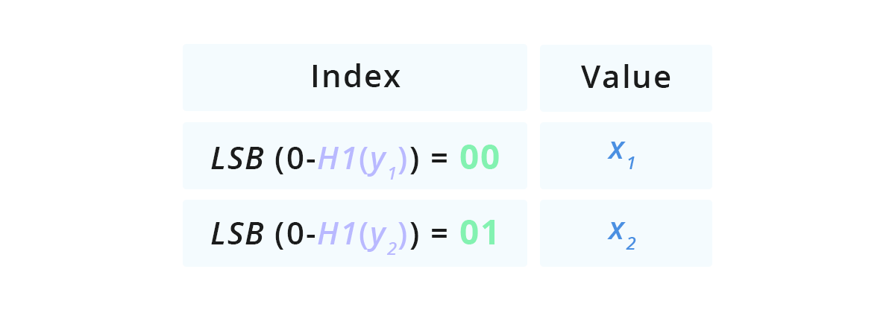
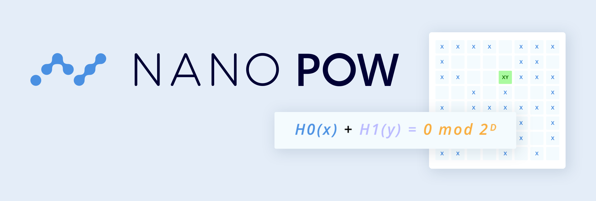

# Nano PoW
Nano PoW is an authentication-free, rate limiting proof-of-work algorithm designed to be memory-hard. It provides a minimal proof size and fast verification while maximizing the generation time-area-product. Nano PoW was designed by Colin LeMahieu.

This repository is an optimized C++ and OpenCL implementation of Nano PoW, intended for use as a rate-limiting, quality of service mechanism on the [Nano](https://nano.org/en) network.

## Algorithm details


Based on the [subset sum problem](https://en.wikipedia.org/wiki/Subset_sum_problem), the Nano PoW proof is a 2 number solution (_x_,_y_), each of N-bits, which are a solution to the equation H0(_x_) + H1(_y_)=0 mod 2ᴰ, where D is a tuned difficulty parameter and H0, H1 are preimage resistant hash functions keyed by a problem nonce P.

This implementation optimizes solution finding using a lookup table with two steps:

1. Randomly filling a lookup table with _x_ values
1. Efficiently searching for potential solutions using _y_ values


The key to this optimization lies in the ability to compare a single y attempt against all stored _x_ candidates in constant time. We’re able to do this by radix-sorting _x_ candidates in to buckets according to LSB(H0(_x_)). When we’re making a _y_ attempt, we can calculate the unique bucket which might contain a solution by rewriting the solution equation to: H0(_x_)=0-H1(_y_) mod 2ᴰ and we know the only place a candidate solution can be is in the bucket LSB(0-H1(_y_)).



If the table is filled with M values, we're able to compare a single y attempt against M x candidates with a single, constant time computation and a memory lookup. We call this multiplicative effect the M-factor.

**Optimizing lookup table size**  
The optimal size of the lookup table is a function of the problem difficulty which determines an optimal M-factor while factoring in the diminishing returns from a high table load factor. Each fill requires an H0 computation and a memory write. Each attempt requires one H1 hash, a memory read, and another H0 hash in order to reconstitute the full hash of the value retrieved.

## Design considerations

**Simple hash algorithm**  
We want to maximize the memory access overhead compared to the compute time overhead, so we want the simplest hash function that both produces uniformly random output and is also preimage resistant. Siphash is extremely easy to implement and provides both of the guarantees we need.

**Lookup versus hash table**  
Since the key we’re storing is already uniformly random there’s no need to calculate an additional hashcode for the key, we can use the value itself. Since we can reconstitute the full key by hashing a bucket’s value, we can avoid storing the key entirely by choosing a lookup table instead of a hash table that would store the full value of both. 

**High load factor**  
To make the best use of allocated memory we want to maximize the table’s load factor taking into consideration the diminishing returns from filling as collisions increase.

**Junk and data-race immune**  
Since there’s no guarantee that any particular bucket will contain an initialized value, the algorithm will proceed even in the face of junk data, data races, or data glitches. This means the entire algorithm can proceed without thread synchronization or atomic memory operations in any phase.



More details on the reference implementation can be found in the  
[Nano PoW - The Details Medium article](https://medium.com/nanocurrency/nano-pow-the-details-ba22a9092d6f).

## Performance

The table below lists the performance, in mean time to generate and validate a proof, for selected CPUs and GPUs. Devices use the optimal number of threads (T), and 2MB pages (where possible). All numbers were obtained for `difficulty` 60. The memory used refers to the size of the lookup table - 4GB corresponds to `lookup` 30, 8GB to `lookup` 31. Results are blank where the required memory exceeds the available memory.

| Device | Memory | OS | Generation 4GB | Generation 8GB | Validation |
|---|---|---|---|---|---|
| **CPU** Intel i5-7200U (4T) | 1x8GB DDR4-2133 CL15 | Linux Mint 18.2 | 135s | - | 60ns |
| **CPU** Intel i5-6600 (4T) | 2x4GB DDR4-2133 CL15 | Ubuntu 18.04 | 80s | - | 43ns |
| **CPU** Intel i7-6700 (8T) | 2x8GB DDR4-2133 CL15 | Ubuntu 16.04 | 77s | 62s | 51ns |
| **CPU** AMD Ryzen 3600 (12T) | 2x8GB DDR4-3600 CL16 | Windows 10 | 47s | 45s | 78ns |
| **CPU** AMD Ryzen 2700X (16T) | 2x8GB DDR4-3400 CL16 | Windows 10 | 38s | 52s | 84ns |
| **CPU** AMD Ryzen 3900X (24T) | 2x8GB DDR4-2400 CL17 | Ubuntu 18.04 | 24s | 25s | 37ns |
| **GPU** Intel HD Graphics 530 (8192T) | 2x4GB DDR4-2133 CL15 | Ubuntu 18.04 | 39s | - | - |
| **GPU** NVIDIA GTX 1070 (16384T) | 8GB GDDR5 | Ubuntu 18.04 | 1.8s | - | - |
| **GPU** NVIDIA GTX 1080Ti (16384T) | 11GB GDDR5X | Ubuntu 18.04 | 1.7s | 2.3s | - |
| **GPU** NVIDIA Tesla V100 SMX2 Google Cloud (32768T) | 16GB HBM2 | Ubuntu 16.04 LTS | 1s | 1.4s | - |
| **GPU** AMD RX 480 (131072T) | 8GB GDDR5 | Ubuntu 18.04 | 2s | 6.2s | - |
| **GPU** AMD Vega 64 (262144T) | 8GB HBM2 | Windows 10 | 0.78s | 7.8s | - |
| **GPU** AMD Radeon VII (524288T) | 16GB HBM2 | Ubuntu 18.04 | 0.55s | 6.2s | - |

## Installation

```
git clone --recursive https://github.com/nanocurrency/nano-pow.git
```

### Requirements

An OpenCL SDK is required.

### Building

Nano PoW uses CMAKE to build a static library and a binary. A shared library will be built in the future instead, to be used as an ABI. Execute the following commands to build the Nano PoW library and the testing binary using CMAKE:

```bash
cmake -DCMAKE_BUILD_TYPE=Release -DNANO_POW_TEST=On .
make
```

Verify that compilation was successful by running the tests

```bash
./nano_pow_driver
```

## Usage

The following arguments are accepted by `nano_pow_driver`:

| Parameter | Description | Possible Values | Default Value |
|---|---|---|---|
| `driver` | Specifies which test driver to use | `cpp`, `opencl` | `cpp` |
| `operation` | Specify which operation to perform | `gtest`, `dump`, `profile`, `profile_validation`, `tune` | `gtest` |
| `difficulty` | Target solution difficulty | 1 - 127 | 52 |
| `threads` | Number of device threads to use to find a solution | - | Number of CPU threads for the `cpp` driver, 8192 for `opencl` |
| `lookup` | Scale of lookup table (N). Table contains 2^N entries | 1 - 32 | `floor(difficulty / 2) + 1` |
| `count` | How many problems to solve | - | 16 |
| `platform` | Defines the platform for the OpenCL driver | - | 0 |
| `device` | Defines the device for the OpenCL driver | - | 0 |
| `verbose` | Display more messages | `true`, `false` | `false` |

### Tuning

The tuning option helps finding the best configuration for a driver and target difficulty.

Example (can take some time):
```
./nano_pow_driver --driver opencl --operation tune --difficulty 60 --count 6
```

### Profiling

```
./nano_pow_driver --driver opencl --operation profile --difficulty 60
```

## API Documentation

Documentation for the API is still pending and will be updated here in the future.
