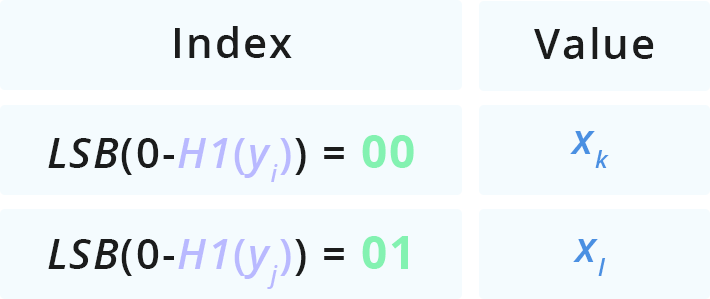

This is an optimized C++ implementation of Nano PoW intended for use as a rate-limiting, Quality of Service mechanism on the Nano network.


Nano PoW is an authentication-free, rate limiting proof-of-work algorithm designed to be memory-hard. It provides a minimal proof size and fast verification while maximizing the time-area-product. Nano PoW was designed by Colin LeMahieu.

## Algorithm details

Based on the [subset sum problem](https://en.wikipedia.org/wiki/Subset_sum_problem), the Nano PoW proof is a 2 number solution (x,y), each of N-bits, which are a solution to the equation H0(x) + H1(y)=0 mod 2^D, where D<2N is a tuned difficulty parameter and H0, H1 are preimage resistant hash functions keyed by a problem nonce P.

This implementation optimizes solution finding using a lookup table with two steps:

1. Randomly filling a lookup table with x values
1. Efficiently searching for potential solutions using a y value


The key to this optimization lies in the ability to compare a single y attempt against all stored x candidates in constant time. We’re able to do this by radix-sorting x candidates in to buckets according to LSB(H0(x)). When we’re making a y attempt, we can calculate the unique bucket which might contain a solution by rewriting the solution equation to: H0(x)=0-H1(y) mod 2^D and we know the only place a candidate solution can be is in the bucket LSB(0-H1(y)).



**Optimizing lookup table size**  
The optimal size of the lookup table is a function of the problem difficulty which determines an optimal M-factor while factoring in the diminishing returns from a high table load factor. Each fill requires an H0 computation and a memory write. Each attempt requires 1 H1 hash, a memory read, and another H0 hash in order to reconstitute the full hash of the value retrieved.

## Design considerations

**Simple hash algorithm**  
We want to maximize the memory access overhead compared to the compute time overhead, so we want the simplest hash function that both produces uniformly random output and is also preimage resistant. Siphash is extremely easy to implement and provides both of the guarantees we need.

**Lookup versus hash table**  
Since the key we’re storing is already uniformly random there’s no need to calculate an additional hashcode for the key, we can use the value itself. Since we can reconstitute the full key by hashing a bucket’s value, we can avoid storing the key entirely by choosing a lookup table instead of a hash table that would store the full value of both. 

**High load factor**  
To make the best use of allocated memory we want to maximize the table’s load factor taking into consideration the diminishing returns from filling as collisions increase.

**LSB-zero-bit difficulty**  
We designed the solution equation to seek 0-bits in the LSB of hash sums in order to get a number that can directly index radix buckets by the bits required.

**Junk and data-race immune**  
Since there’s no guarantee that any particular bucket will contain an initialized value, the algorithm will proceed even in the face of junk data, data races, or data glitches. This means the entire algorithm can proceed without thread synchronization or atomic memory operations in any phase.

More details on the reference implementation can be found in the Nano PoW - The Details Medium article.

## Performance
TBD

## Bounties?
TBD


## Installation

```
git clone --recursive git@github.com:nanocurrency/ssp-pow.git
```

### Dependencies

* boost >=1.67


### Build

```
mkdir build
cd build
cmake ..
make
./ssp_pow_driver --help
```
### Run benchmark

```
./ssp_pow_driver --driver cpp --threads 16
```